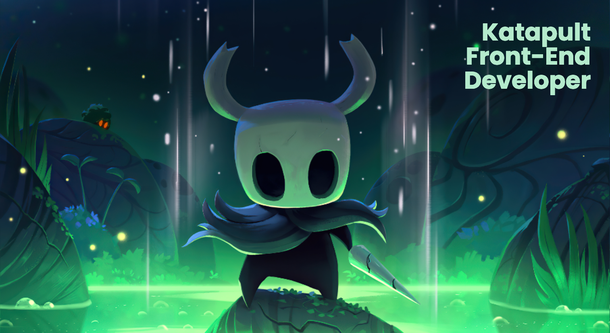
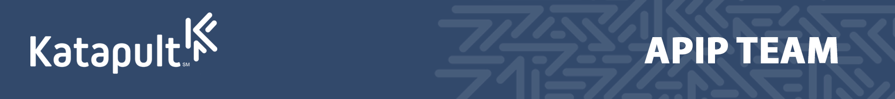

# My main stack of technologies:

### Prefer to bundle and deliver projects with

### Have the best experience in frameworks:

### Used to test and refactor code with:

### Browsers I use on daily bases:

### My main code editor is:

<!--
**artem-deikun-katapult/artem-deikun-katapult** is a ✨ _special_ ✨ repository because its `README.md` (this file) appears on your GitHub profile.

Here are some ideas to get you started:

- 🔭 I’m currently working on ...
- 🌱 I’m currently learning ...
- 👯 I’m looking to collaborate on ...
- 🤔 I’m looking for help with ...
- 💬 Ask me about ...
- 📫 How to reach me: ...
- 😄 Pronouns: ...
- ⚡ Fun fact: ...
-->
